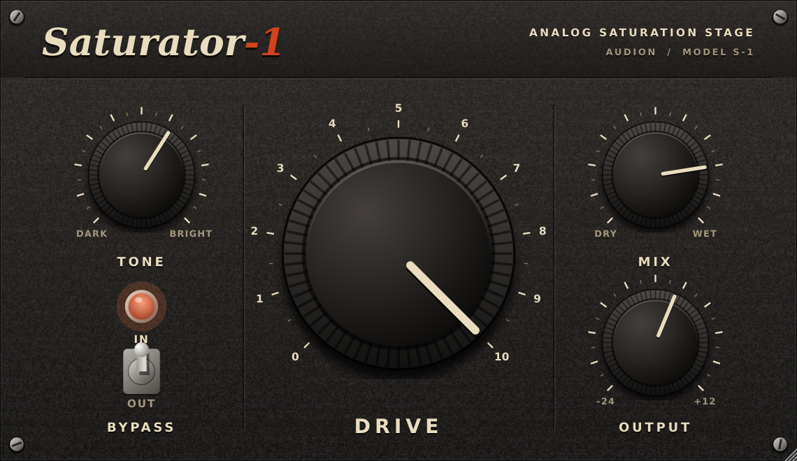

# Saturator-1

JUCEで作った、ヴィンテージのアウトボード機材風UIのサチュレーター・プラグインです(VST3 / AU / Standalone)。
tanhによるソフトクリッピングを4倍オーバーサンプリング内で行い、Drive・Tone・Mix・Outputの4つのノブで音作りできます。



## 機能

- **Drive** — 0〜10のスケールで入力ゲイン(最大25倍)を上げ、tanhで飽和させる。ドライブ量に応じて出力を正規化するので、上げても音量が極端に変わらない
- **Tone** — サチュレーション後段のローパスフィルタ。カットオフは800 Hz〜16 kHz(DARK〜BRIGHT)
- **Mix** — ドライ/ウェットのブレンド(パラレル・サチュレーション)
- **Output** — 出力レベル(-24〜+12 dB)
- **Bypass** — ホストのバイパスと連携。10 msのクロスフェードで切り替えるためクリック音が出ない
- **リサイズ可能なベクターUI** — 画像アセットを使わず、ノブ・トグルスイッチ・パネルの質感をすべてコードで描画(縦横比固定で60〜160%)

## 操作方法

| 操作 | 動作 |
| --- | --- |
| ノブを上下/左右にドラッグ | 値を変更(操作中は値をポップアップ表示) |
| ノブをダブルクリック | デフォルト値に戻す |
| トグルスイッチをクリック | IN / OUT(バイパス)を切替。IN時はパイロットランプが点灯 |
| ウィンドウ右下をドラッグ | UIを拡大・縮小 |

## 信号の流れ

```
Input ─┬─ Drive(ゲイン) → [4x オーバーサンプリング: tanh] → 正規化 → Tone(LPF) ─┐
       │                                                                          ├─ Mix → Output → Bypassクロスフェード
       └─ ドライ遅延(オーバーサンプリングのレイテンシ分) ───────────────────────┘
```

### 設計のポイント

- **非線形処理だけをオーバーサンプリング** — エイリアシングの原因になるtanhのみを4倍オーバーサンプリング区間内で処理し、
  ゲイン・正規化・Toneフィルタは元のサンプルレートで処理して負荷を抑えています。
- **ドライ信号の位相合わせ** — オーバーサンプリングには線形位相のFIRハーフバンドフィルタを使い、
  ドライ信号をそのレイテンシ分だけ単純遅延させています。これによりMixが中間値のときもコムフィルタが発生しません。
  レイテンシは`setLatencySamples()`でホストに報告しています。
- **パラメータスムージング** — Drive / Tone / Mix / Outputは20 msのランプでサンプル単位に補間し、ジッパーノイズを抑制しています。
- **オーディオスレッドでのメモリ確保なし** — Toneフィルタの係数は`IIR::ArrayCoefficients`(`std::array`を返す)で更新し、
  ヒープ確保を避けています。

## 構成

```
Source/
├── PluginProcessor.*   オーディオ処理本体、APVTSのパラメータ定義
└── PluginEditor.*      エディタとカスタムLookAndFeel(ノブ、バイパススイッチ、パネルの描画)
```

## ビルド

[JUCE](https://github.com/juce-framework/JUCE)とCMake 3.22以上が必要です。
`CMakeLists.txt`は1つ上の階層にあるJUCEを参照するので、次のように配置してください。

```
plugins/
├── JUCE/           ← git clone https://github.com/juce-framework/JUCE.git
└── Saturator-1/    ← このリポジトリ
```

```bash
cmake -B build -DCMAKE_BUILD_TYPE=Release
cmake --build build -j$(nproc)
```

ビルド成果物は`build/Saturator1_artefacts/Release/`以下(`VST3/`、`Standalone/`、macOSでは`AU/`)に出力されます。

```bash
# スタンドアロン版の起動
./build/Saturator1_artefacts/Release/Standalone/Saturator-1
```
